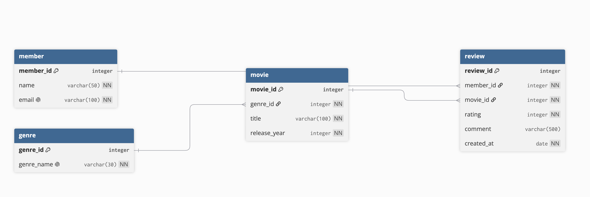
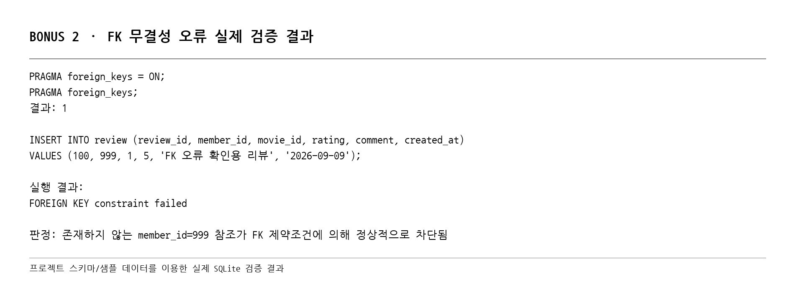

# B6-1 · 영화 평점 데이터베이스

SQLite를 사용해 **영화 평점 관리 도메인**을 관계형 데이터베이스로 설계하고, PK/FK/제약조건부터 샘플 데이터, 조회·조인·집계·서브쿼리·수정·삭제·인덱스까지 SQL로 구현한 미션입니다. 백엔드 프레임워크는 사용하지 않았으며 macOS의 **VS Code + SQLite Extension** 환경을 기준으로 작성했습니다.

## 1. 요구사항 충족 근거 요약

| 항목 | 구현/증빙 |
| --- | --- |
| 테이블 4개 및 PK | `1.schema.sql` · `member`, `genre`, `movie`, `review` |
| 1:N 관계 / FK | 3개 · [`result/fk_validation.txt`](result/fk_validation.txt) |
| 테이블별 10행 이상 | `member 10`, `genre 10`, `movie 10`, `review 11` |
| 핵심 SQL 15개 | `3.queries.sql` Q01~Q15 |
| 실행 결과 텍스트 | `result/q01.txt` ~ `result/q15.txt` |
| 실행 결과 이미지 | `result/screenshots/q01.png` ~ `q15.png` |
| ERD | `docs/ERD.png` |
| FK 오류 증빙 | `docs/bonus2-error.png` |
| 정규화/타입/PK·FK/DB vs 엑셀 설명 | README + [`result/design_evidence.txt`](result/design_evidence.txt) |
| JOIN 차이 | [`result/join_comparison.txt`](result/join_comparison.txt) |
| GROUP BY/집계 설명 | [`result/aggregation_evidence.txt`](result/aggregation_evidence.txt) |
| 복합 쿼리 단계 설명 | [`result/q12_logic.txt`](result/q12_logic.txt) |
| 전체 증빙 체크리스트 | [`result/requirements_evidence.txt`](result/requirements_evidence.txt) |

## 2. 개발 환경

| 항목 | 내용 |
| --- | --- |
| OS | macOS |
| DB | SQLite |
| SQL 실행 도구 | VS Code SQLite Extension |
| 백엔드 프레임워크 | 사용하지 않음 |
| SQL 작성 원칙 | 가급적 표준 SQL 사용, SQLite 전용 문법은 주석으로 명시 |

SQLite 전용으로 사용한 대표 문법은 `PRAGMA`와 `EXPLAIN QUERY PLAN`입니다. `LIMIT`은 DBMS별 차이가 있는 행 제한 문법이며 과제에서 직접 요구하므로 사용하고 주석으로 명시했습니다.

## 3. 프로젝트 구조

```text
B6-1/
├── 0.movie_rating.db3
├── 1.schema.sql
├── 2.sample_data.sql
├── 3.queries.sql
├── 4.bonus_fk_test.sql
├── README.md
├── docs/
│   ├── ERD.png
│   ├── bonus2-error.png
│   └── bonus2-vscode-original.png
└── result/
    ├── q01.txt ~ q15.txt
    ├── fk_validation.txt
    ├── constraint_validation.txt
    ├── design_evidence.txt
    ├── join_comparison.txt
    ├── aggregation_evidence.txt
    ├── q12_logic.txt
    ├── requirements_evidence.txt
    └── screenshots/
        ├── q01.png ~ q15.png
        ├── fk_validation.png
        ├── fk_test_1.png ~ fk_test_3.png
        └── constraint_validation.png
```

## 4. ERD와 관계



| 부모 | 자식 | FK | 관계 의미 |
| --- | --- | --- | --- |
| `genre` | `movie` | `movie.genre_id → genre.genre_id` | 하나의 장르에는 여러 영화가 속할 수 있음 |
| `member` | `review` | `review.member_id → member.member_id` | 한 회원은 여러 리뷰를 작성할 수 있음 |
| `movie` | `review` | `review.movie_id → movie.movie_id` | 한 영화에는 여러 회원의 리뷰가 작성될 수 있음 |

각 FK의 실제 `PRAGMA foreign_key_list` 결과와 존재하지 않는 부모 키 입력 실패 테스트는 [`result/fk_validation.txt`](result/fk_validation.txt)에 있습니다.

## 5. 스키마 설계

### 5.1 테이블 역할과 PK 선정 이유

| 테이블 | 역할 | PK | 선정 이유 |
| --- | --- | --- | --- |
| `member` | 회원 정보 | `member_id` | 이름/이메일이 바뀌어도 회원을 안정적으로 식별 |
| `genre` | 장르 정보 | `genre_id` | 장르명을 관계 키로 직접 사용하지 않고 독립 식별 |
| `movie` | 영화 정보 | `movie_id` | 제목 중복 가능성과 무관하게 영화를 유일하게 식별 |
| `review` | 회원의 영화 리뷰/평점 | `review_id` | 동일 회원이 여러 리뷰를 작성해도 각 리뷰를 독립 식별 |

**PK(Primary Key)** 는 테이블의 각 행을 유일하게 식별합니다. **FK(Foreign Key)** 는 다른 테이블의 PK를 참조하여 테이블 간 관계를 연결하고 존재하지 않는 부모 값을 참조하지 못하게 해 참조 무결성을 유지합니다.

### 5.2 컬럼 타입 선정 이유

| 주요 컬럼 | 타입 | 이유 |
| --- | --- | --- |
| `*_id` | `INTEGER` | 정수 식별자로 PK/FK 비교와 JOIN 기준에 적합 |
| `release_year` | `INTEGER` | 연도 숫자 비교/정렬에 사용 |
| `rating` | `INTEGER` | 1~5 정수 평점이며 `CHECK`로 범위 제한 |
| 이름/이메일/장르명/제목/리뷰 | `VARCHAR` | 길이가 가변적인 문자열 |
| `created_at` | `DATE` | 리뷰 작성일만 필요하며 시각 정보가 필요 없어 `DATETIME` 대신 날짜 의미로 선언 |

SQLite는 동적 타입 시스템이므로 `VARCHAR(50)` 길이와 `DATE` 형식을 일부 DBMS처럼 엄격히 강제하지는 않습니다. 이 미션에서는 컬럼 의미가 명확하고 표준 SQL에 가까운 스키마를 작성하기 위해 해당 타입명을 사용했습니다.

### 5.3 제약조건

- 모든 테이블: `PRIMARY KEY`
- 필수 컬럼: `NOT NULL`
- `member.email`, `genre.genre_name`: `UNIQUE`
- `review.rating`: `CHECK (rating BETWEEN 1 AND 5)`
- FK 3개: 장르-영화, 회원-리뷰, 영화-리뷰
- 별도 `ON DELETE` 옵션을 지정하지 않아 SQLite 기본 `NO ACTION` 사용

제약조건과 경계값(`rating=1/5` 정상, `0/6` 실패, `comment=NULL` 허용)을 별도 연결에서 검증하고 ROLLBACK한 결과는 [`result/constraint_validation.txt`](result/constraint_validation.txt)에 있습니다.

### 5.4 테이블 분리와 정규화

회원·장르·영화·리뷰를 역할별 테이블로 분리해 `review`에 회원명, 영화명, 장르명을 반복 저장하지 않습니다. 이를 통해 중복과 갱신 이상을 줄였습니다. 각 컬럼은 원자값을 저장하고, 단일 컬럼 PK를 사용하며 비키 속성이 해당 테이블의 PK에 종속되도록 구성해 **단순한 3NF 수준의 구조**를 목표로 했습니다.

### 5.5 엑셀과 관계형 DB의 차이

엑셀은 데이터를 자유롭게 입력·수정하기 편하지만 일반적인 셀 입력만으로는 존재하지 않는 `member_id`를 리뷰에 입력하는 것 같은 참조 오류를 자동 차단하지 않습니다. 관계형 DB는 `PK`, `FK`, `NOT NULL`, `UNIQUE`, `CHECK`로 중복·누락·잘못된 참조를 DB 수준에서 차단하고, `JOIN`으로 분리된 테이블을 관계 기준으로 결합할 수 있습니다.

## 6. 샘플 데이터

| 테이블 | 행 수 | 검증용 특징 |
| --- | ---: | --- |
| `member` | 10 | `임하늘(member_id=10)`은 리뷰 없음 |
| `genre` | 10 | 장르 10개 |
| `movie` | 10 | `사라진 기록(movie_id=10)`은 리뷰 없음 |
| `review` | 11 | Q14 DELETE 이후에도 10행 유지 |

리뷰 없는 회원/영화는 `LEFT JOIN`, `NOT EXISTS`, `COUNT`의 비매칭/0건 케이스를 확인하기 위한 의도적인 데이터입니다. 샘플 데이터 자체를 오염시키지 않고 수행한 경계/예외 테스트는 `result/constraint_validation.txt`에 분리했습니다.

## 7. 핵심 SQL 15개와 실행 증빙

| Q | 유형 | 핵심 문법 | 결과 텍스트 | 실행 결과 이미지 |
| ---: | --- | --- | --- | --- |
| Q01 | 기본 조회 - WHERE | 2023년 이후 개봉한 영화를 조회한다. | [`q01.txt`](result/q01.txt) | [`q01.png`](result/screenshots/q01.png) |
| Q02 | 기본 조회 - ORDER BY | 영화를 최신 개봉 연도 순으로 조회한다. | [`q02.txt`](result/q02.txt) | [`q02.png`](result/screenshots/q02.png) |
| Q03 | 기본 조회 - ORDER BY + LIMIT | 최신 영화 중 상위 5개를 조회한다. | [`q03.txt`](result/q03.txt) | [`q03.png`](result/screenshots/q03.png) |
| Q04 | 기본 조회 - WHERE + ORDER BY | 평점이 4점 이상인 리뷰를 높은 평점 순으로 조회한다. | [`q04.txt`](result/q04.txt) | [`q04.png`](result/screenshots/q04.png) |
| Q05 | INNER JOIN | 리뷰를 작성한 회원의 이름과 평점, 리뷰 내용을 조회한다. | [`q05.txt`](result/q05.txt) | [`q05.png`](result/screenshots/q05.png) |
| Q06 | INNER JOIN | 영화 제목과 해당 영화의 평점 및 리뷰 내용을 조회한다. | [`q06.txt`](result/q06.txt) | [`q06.png`](result/screenshots/q06.png) |
| Q07 | INNER JOIN | 각 영화의 제목과 장르를 조회한다. | [`q07.txt`](result/q07.txt) | [`q07.png`](result/screenshots/q07.png) |
| Q08 | LEFT JOIN | 리뷰를 한 번도 작성하지 않은 회원을 조회한다. | [`q08.txt`](result/q08.txt) | [`q08.png`](result/screenshots/q08.png) |
| Q09 | 집계 - COUNT + GROUP BY | 영화별 리뷰 개수를 조회한다. | [`q09.txt`](result/q09.txt) | [`q09.png`](result/screenshots/q09.png) |
| Q10 | 집계 - AVG + GROUP BY | 리뷰가 존재하는 영화의 평균 평점을 조회한다. | [`q10.txt`](result/q10.txt) | [`q10.png`](result/screenshots/q10.png) |
| Q11 | 집계 - COUNT + GROUP BY | 회원별 리뷰 작성 횟수를 조회한다. | [`q11.txt`](result/q11.txt) | [`q11.png`](result/screenshots/q11.png) |
| Q12 | 상관 서브쿼리 - NOT EXISTS | 서브쿼리를 이용해 리뷰를 작성하지 않은 회원을 조회한다. | [`q12.txt`](result/q12.txt) | [`q12.png`](result/screenshots/q12.png) |
| Q13 | UPDATE | review_id가 5인 리뷰의 평점과 내용을 수정한다. | [`q13.txt`](result/q13.txt) | [`q13.png`](result/screenshots/q13.png) |
| Q14 | DELETE | review_id가 11인 리뷰를 삭제한다. | [`q14.txt`](result/q14.txt) | [`q14.png`](result/screenshots/q14.png) |
| Q15 | CREATE INDEX | review.movie_id 인덱스를 생성하고 사용 여부를 확인한다. | [`q15.txt`](result/q15.txt) | [`q15.png`](result/screenshots/q15.png) |

모든 Q01~Q15는 동일한 초기 스키마/샘플 데이터에서 순서대로 실제 SQLite 검증을 수행해 텍스트와 이미지 증빙을 생성했습니다. Q13은 변경 전/후, Q14는 삭제 전/후, Q15는 인덱스 목록과 `EXPLAIN QUERY PLAN`까지 포함합니다.

## 8. INNER JOIN과 LEFT JOIN 차이

`INNER JOIN`은 **양쪽 테이블에서 JOIN 조건이 일치하는 행만** 반환합니다. Q05에서는 리뷰를 작성한 회원만 조회되므로 리뷰가 없는 `임하늘`은 결과에 나타나지 않습니다.

`LEFT JOIN`은 **왼쪽 테이블의 모든 행을 유지**하고 오른쪽에 매칭되는 행이 없으면 오른쪽 컬럼을 `NULL`로 반환합니다. Q08은 `member`를 왼쪽에 두고 `WHERE r.review_id IS NULL`을 사용하여 리뷰가 없는 `임하늘`을 조회합니다.

Q08 실제 결과: `member_id=10, name=임하늘`. 자세한 비교는 [`result/join_comparison.txt`](result/join_comparison.txt)에 있습니다.

## 9. GROUP BY와 집계 함수

`GROUP BY`는 같은 기준 값을 가진 행을 그룹으로 묶어 그룹 단위 계산을 수행합니다. `COUNT`는 개수, `AVG`는 평균, `SUM`은 합계를 계산합니다. 과제는 `COUNT`, `SUM`, `AVG` 중 2개 이상을 요구하므로 이 프로젝트는 `COUNT`와 `AVG`를 사용해 충족했습니다.

- Q09: 영화별 `COUNT(review_id)`
- Q10: 영화별 `AVG(rating)`
- Q11: 회원별 `COUNT(review_id)`

Q09의 처리 흐름은 **`movie와 review LEFT JOIN → 영화별 GROUP BY → COUNT(review_id) → 리뷰 수 정렬`**이며 리뷰 없는 영화도 남기 때문에 `사라진 기록`의 리뷰 수는 0입니다. 자세한 설명은 [`result/aggregation_evidence.txt`](result/aggregation_evidence.txt)에 있습니다.

## 10. 복합 쿼리 단계별 설명 — Q12 `NOT EXISTS`

```sql
SELECT m.member_id
     , m.name
  FROM member AS m
 WHERE NOT EXISTS (
       SELECT 1
         FROM review AS r
        WHERE r.member_id = m.member_id
       );
```

1. 바깥 쿼리에서 `member`를 한 명씩 확인합니다.
2. 내부 상관 서브쿼리에서 현재 `member_id`와 같은 `review`가 존재하는지 검사합니다.
3. 리뷰가 있으면 `NOT EXISTS = FALSE`가 되어 제외합니다.
4. 리뷰가 없으면 `NOT EXISTS = TRUE`가 되어 결과에 포함합니다.
5. 샘플 데이터에서는 `임하늘(member_id=10)`만 반환됩니다.

처리 흐름: **`member 조회 → 회원별 review 존재 여부 검사 → 리뷰 없는 회원 선택`**. 추가 설명은 [`result/q12_logic.txt`](result/q12_logic.txt)에 있습니다.

## 11. 인덱스

```sql
CREATE INDEX idx_review_movie_id
    ON review(movie_id);
```

`review.movie_id`는 Q06/Q09/Q10 등에서 영화-리뷰 JOIN 조건으로 반복 사용되므로 인덱스를 생성했습니다. 인덱스는 조회 성능 향상에 도움이 되지만 `INSERT/UPDATE/DELETE` 시 인덱스 유지 비용과 저장 공간이 추가됩니다. 샘플 데이터가 작기 때문에 실행시간 숫자 비교보다는 `EXPLAIN QUERY PLAN`으로 실제 인덱스 사용을 검증했습니다.

검증 결과: `SEARCH review USING INDEX idx_review_movie_id (movie_id=?)` — [`result/q15.txt`](result/q15.txt)

## 12. 보너스 과제

### Bonus 1. 같은 요구를 JOIN과 서브쿼리로 해결

리뷰 없는 회원을 Q08 `LEFT JOIN`과 Q12 `NOT EXISTS` 두 방식으로 조회했으며 둘 다 `임하늘(member_id=10)`을 반환합니다. JOIN은 테이블을 결합한 뒤 비매칭 행을 찾고, `NOT EXISTS`는 각 회원에 대해 리뷰 존재 여부를 검사한다는 차이가 있습니다.

### Bonus 2. FK 무결성 깨뜨려 보기

의도적인 실패 테스트는 메인 `3.queries.sql`과 분리한 `4.bonus_fk_test.sql`에서 실행합니다. `member_id=999`를 참조하는 리뷰 입력은 `FOREIGN KEY constraint failed`로 거부됩니다.



원본 VS Code 실행 화면도 [`docs/bonus2-vscode-original.png`](docs/bonus2-vscode-original.png)로 함께 보관했습니다.

3개의 모든 FK에 대한 정의/1:N 의미/실패 테스트는 [`result/fk_validation.txt`](result/fk_validation.txt)와 `result/screenshots/fk_test_1.png~fk_test_3.png`에 있습니다.

### Bonus 3. 미니 리포트

- 영화별 리뷰 수: Q09
- 영화별 평균 평점: Q10
- 회원별 리뷰 작성 수: Q11

이 세 지표를 통해 영화별 관심도, 평가 수준, 회원별 리뷰 활동량을 확인할 수 있습니다.

## 13. 트러블슈팅과 학습 내용

### `table member already exists`
이미 테이블이 존재하는 DB에 `1.schema.sql`을 다시 실행해 발생했습니다. 재현 검증 시 새 빈 DB를 만들고 `schema → sample_data → queries` 순서로 실행하도록 정리했습니다.

### `PRAGMA foreign_keys`가 0으로 조회됨
SQLite의 FK 강제 설정은 DB 파일에 영구 저장되는 값이 아니라 **연결 단위**입니다. SQL 문서/연결이 달라지면 0으로 보일 수 있어 FK 테스트와 동일한 연결에서 `PRAGMA foreign_keys = ON;`을 실행한 후 `PRAGMA foreign_keys; = 1`을 확인했습니다. 또한 `foreign_key_list`(FK 정의)와 `foreign_keys`(현재 연결의 FK 강제 여부)를 구분해 검증했습니다.

### 스크립트 재실행 중복
샘플 데이터를 다시 실행하면 PK/UNIQUE 중복, Q15를 다시 실행하면 인덱스 중복 오류가 발생할 수 있습니다. 따라서 검증은 새 DB에서 순서대로 한 번 실행합니다.

## 14. 실행 방법

### 포함된 `0.movie_rating.db3` 사용
최종 ZIP의 `0.movie_rating.db3`는 **스키마 + 초기 샘플 데이터(리뷰 11건), Q01~Q15 실행 전 상태**입니다. 따라서 이 DB에서 Q01~Q15를 순서대로 직접 실행할 수 있습니다.

### 처음부터 재현
1. VS Code에서 새 빈 SQLite DB 파일을 생성합니다.
2. 같은 연결에서 `1.schema.sql`을 실행합니다.
3. `2.sample_data.sql`을 실행합니다.
4. `3.queries.sql`의 Q01~Q15를 순서대로 실행합니다.
5. 보너스 2는 의도적인 실패 테스트이므로 `4.bonus_fk_test.sql`을 별도로 실행합니다.

## 15. 최종 체크리스트

- [x] SQLite 로컬 DB
- [x] 테이블 4개, 모든 테이블 PK
- [x] FK 3개, 1:N 관계 3개
- [x] NOT NULL / UNIQUE / CHECK
- [x] 테이블별 10행 이상 샘플 데이터
- [x] 기본 조회 4개
- [x] JOIN 4개 (INNER 3, LEFT 1)
- [x] 집계 3개 (COUNT/AVG + GROUP BY)
- [x] 서브쿼리 1개
- [x] UPDATE / DELETE
- [x] CREATE INDEX + 이유 + 실행 계획
- [x] Q01~Q15 결과 텍스트
- [x] Q01~Q15 실행 결과 이미지
- [x] ERD
- [x] 보너스 1~3
- [x] 타입 선정, 정규화, PK/FK, JOIN, 집계, 복합 쿼리 설명
- [x] FK/제약조건/경계값 검증 및 트러블슈팅 기록
